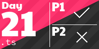

## Advent of Code

<!-- AOC TILES BEGIN -->
<h1 align="center">
  2024 - 38 ⭐
</h1>
<a href="src/2024/01/index.ts">
  
</a>
<a href="src/2024/02/index.ts">
  
</a>
<a href="src/2024/03/index.ts">
  
</a>
<a href="src/2024/04/index.ts">
  
</a>
<a href="src/2024/05/index.ts">
  
</a>
<a href="src/2024/06/index.ts">
  
</a>
<a href="src/2024/07/index.ts">
  
</a>
<a href="src/2024/08/index.ts">
  
</a>
<a href="src/2024/09/index.ts">
  
</a>
<a href="src/2024/10/index.ts">
  
</a>
<a href="src/2024/11/index.ts">
  
</a>
<a href="src/2024/12/index.ts">
  
</a>
<a href="src/2024/13/index.ts">
  
</a>
<a href="src/2024/14/index.ts">
  
</a>
<a href="src/2024/15/index.ts">
  
</a>
<a href="src/2024/16/index.ts">
  
</a>
<a href="src/2024/17/index.ts">
  
</a>
<a href="src/2024/18/index.ts">
  
</a>
<a href="src/2024/19/index.ts">
  
</a>
<h1 align="center">
  2023 - 50 ⭐
</h1>
<a href="src/2023/01/index.ts">
  
</a>
<a href="src/2023/02/index.ts">
  
</a>
<a href="src/2023/03/index.ts">
  
</a>
<a href="src/2023/04/index.ts">
  
</a>
<a href="src/2023/05/index.ts">
  
</a>
<a href="src/2023/06/index.ts">
  
</a>
<a href="src/2023/07/index.ts">
  
</a>
<a href="src/2023/08/index.ts">
  
</a>
<a href="src/2023/09/index.ts">
  
</a>
<a href="src/2023/10/index.ts">
  
</a>
<a href="src/2023/11/index.ts">
  
</a>
<a href="src/2023/12/index.ts">
  
</a>
<a href="src/2023/13/index.ts">
  
</a>
<a href="src/2023/14/index.ts">
  
</a>
<a href="src/2023/15/index.ts">
  
</a>
<a href="src/2023/16/index.ts">
  
</a>
<a href="src/2023/17/index.ts">
  
</a>
<a href="src/2023/18/index.ts">
  
</a>
<a href="src/2023/19/index.ts">
  
</a>
<a href="src/2023/20/index.ts">
  
</a>
<a href="src/2023/21/index.ts">
  
</a>
<a href="src/2023/22/index.ts">
  
</a>
<a href="src/2023/23/index.ts">
  
</a>
<a href="src/2023/24/index.ts">
  
</a>
<a href="src/2023/25/index.ts">
  
</a>
<h1 align="center">
  2022 - 46 ⭐
</h1>
<a href="src/2022/01/index.ts">
  
</a>
<a href="src/2022/02/index.ts">
  
</a>
<a href="src/2022/03/index.ts">
  
</a>
<a href="src/2022/04/index.ts">
  
</a>
<a href="src/2022/05/index.ts">
  
</a>
<a href="src/2022/06/index.ts">
  
</a>
<a href="src/2022/07/index.ts">
  
</a>
<a href="src/2022/08/index.ts">
  
</a>
<a href="src/2022/09/index.ts">
  
</a>
<a href="src/2022/10/index.ts">
  
</a>
<a href="src/2022/11/index.ts">
  
</a>
<a href="src/2022/12/index.ts">
  
</a>
<a href="src/2022/13/index.ts">
  
</a>
<a href="src/2022/14/index.ts">
  
</a>
<a href="src/2022/15/index.ts">
  
</a>
<a href="src/2022/16/index.ts">
  
</a>
<a href="src/2022/17/index.ts">
  
</a>
<a href="src/2022/18/index.ts">
  
</a>
<a href="src/2022/19/index.ts">
  
</a>
<a href="src/2022/20/index.ts">
  
</a>
<a href="src/2022/21/index.ts">
  
</a>
<a href="src/2022/22/index.ts">
  
</a>
<a href="src/2022/23/index.ts">
  
</a>
<a href="src/2022/24/index.ts">
  
</a>
<a href="src/2022/25/index.ts">
  
</a>
<h1 align="center">
  2021 - 47 ⭐
</h1>
<a href="src/2021/01/index.ts">
  
</a>
<a href="src/2021/02/index.ts">
  
</a>
<a href="src/2021/03/index.ts">
  
</a>
<a href="src/2021/04/index.ts">
  
</a>
<a href="src/2021/05/index.ts">
  
</a>
<a href="src/2021/06/index.ts">
  
</a>
<a href="src/2021/07/index.ts">
  
</a>
<a href="src/2021/08/index.ts">
  
</a>
<a href="src/2021/09/index.ts">
  
</a>
<a href="src/2021/10/index.ts">
  
</a>
<a href="src/2021/11/index.ts">
  
</a>
<a href="src/2021/12/index.ts">
  
</a>
<a href="src/2021/13/index.ts">
  
</a>
<a href="src/2021/14/index.ts">
  
</a>
<a href="src/2021/15/index.ts">
  
</a>
<a href="src/2021/16/index.ts">
  
</a>
<a href="src/2021/17/index.ts">
  
</a>
<a href="src/2021/18/index.ts">
  
</a>
<a href="src/2021/19/index.ts">
  
</a>
<a href="src/2021/20/index.ts">
  
</a>
<a href="src/2021/21/index.ts">
  
</a>
<a href="src/2021/22/index.ts">
  
</a>
<a href="src/2021/23/index.ts">
  
</a>
<a href="src/2021/24/index.ts">
  
</a>
<a href="src/2021/25/index.ts">
  
</a>
<h1 align="center">
  2020 - 50 ⭐
</h1>
<a href="src/2020/01/index.ts">
  
</a>
<a href="src/2020/02/index.ts">
  
</a>
<a href="src/2020/03/index.ts">
  
</a>
<a href="src/2020/04/index.ts">
  
</a>
<a href="src/2020/05/index.ts">
  
</a>
<a href="src/2020/06/index.ts">
  
</a>
<a href="src/2020/07/index.ts">
  
</a>
<a href="src/2020/08/index.ts">
  
</a>
<a href="src/2020/09/index.ts">
  
</a>
<a href="src/2020/10/index.ts">
  
</a>
<a href="src/2020/11/index.ts">
  
</a>
<a href="src/2020/12/index.ts">
  
</a>
<a href="src/2020/13/index.ts">
  
</a>
<a href="src/2020/14/index.ts">
  
</a>
<a href="src/2020/15/index.ts">
  
</a>
<a href="src/2020/16/index.ts">
  
</a>
<a href="src/2020/17/index.ts">
  
</a>
<a href="src/2020/18/index.ts">
  
</a>
<a href="src/2020/19/index.ts">
  
</a>
<a href="src/2020/20/index.ts">
  
</a>
<a href="src/2020/21/index.ts">
  
</a>
<a href="src/2020/22/index.ts">
  
</a>
<a href="src/2020/23/index.ts">
  
</a>
<a href="src/2020/24/index.ts">
  
</a>
<a href="src/2020/25/index.ts">
  
</a>
<h1 align="center">
  2019 - 47 ⭐
</h1>
<a href="src/2019/01/index.ts">
  
</a>
<a href="src/2019/02/index.ts">
  
</a>
<a href="src/2019/03/index.ts">
  
</a>
<a href="src/2019/04/index.ts">
  
</a>
<a href="src/2019/05/index.ts">
  
</a>
<a href="src/2019/06/index.ts">
  
</a>
<a href="src/2019/07/index.ts">
  
</a>
<a href="src/2019/08/index.ts">
  
</a>
<a href="src/2019/09/index.ts">
  
</a>
<a href="src/2019/10/index.ts">
  
</a>
<a href="src/2019/11/index.ts">
  
</a>
<a href="src/2019/12/index.ts">
  
</a>
<a href="src/2019/13/index.ts">
  
</a>
<a href="src/2019/14/index.ts">
  
</a>
<a href="src/2019/15/index.ts">
  
</a>
<a href="src/2019/16/index.ts">
  
</a>
<a href="src/2019/17/index.ts">
  
</a>
<a href="src/2019/18/index.ts">
  
</a>
<a href="src/2019/19/index.ts">
  
</a>
<a href="src/2019/20/index.ts">
  
</a>
<a href="src/2019/21/index.ts">
  
</a>
<a href="src/2019/22/index.ts">
  
</a>
<a href="src/2019/23/index.ts">
  
</a>
<a href="src/2019/24/index.ts">
  
</a>
<a href="src/2019/25/index.ts">
  
</a>
<h1 align="center">
  2018 - 50 ⭐
</h1>
<a href="src/2018/01/index.ts">
  
</a>
<a href="src/2018/02/index.ts">
  
</a>
<a href="src/2018/03/index.ts">
  
</a>
<a href="src/2018/04/index.ts">
  
</a>
<a href="src/2018/05/index.ts">
  
</a>
<a href="src/2018/06/index.ts">
  
</a>
<a href="src/2018/07/index.ts">
  
</a>
<a href="src/2018/08/index.ts">
  
</a>
<a href="src/2018/09/index.ts">
  
</a>
<a href="src/2018/10/index.ts">
  
</a>
<a href="src/2018/11/index.ts">
  
</a>
<a href="src/2018/12/index.ts">
  
</a>
<a href="src/2018/13/index.ts">
  
</a>
<a href="src/2018/14/index.ts">
  
</a>
<a href="src/2018/15/index.ts">
  
</a>
<a href="src/2018/16/index.ts">
  
</a>
<a href="src/2018/17/index.ts">
  
</a>
<a href="src/2018/18/index.ts">
  
</a>
<a href="src/2018/19/index.ts">
  
</a>
<a href="src/2018/20/index.ts">
  
</a>
<a href="src/2018/21/index.ts">
  
</a>
<a href="src/2018/22/index.ts">
  
</a>
<a href="src/2018/23/index.ts">
  
</a>
<a href="src/2018/24/index.ts">
  
</a>
<a href="src/2018/25/index.ts">
  
</a>
<h1 align="center">
  2017 - 50 ⭐
</h1>
<a href="src/2017/01/index.ts">
  
</a>
<a href="src/2017/02/index.ts">
  
</a>
<a href="src/2017/03/index.ts">
  
</a>
<a href="src/2017/04/index.ts">
  
</a>
<a href="src/2017/05/index.ts">
  
</a>
<a href="src/2017/06/index.ts">
  
</a>
<a href="src/2017/07/index.ts">
  
</a>
<a href="src/2017/08/index.ts">
  
</a>
<a href="src/2017/09/index.ts">
  
</a>
<a href="src/2017/10/index.ts">
  
</a>
<a href="src/2017/11/index.ts">
  
</a>
<a href="src/2017/12/index.ts">
  
</a>
<a href="src/2017/13/index.ts">
  
</a>
<a href="src/2017/14/index.ts">
  
</a>
<a href="src/2017/15/index.ts">
  
</a>
<a href="src/2017/16/index.ts">
  
</a>
<a href="src/2017/17/index.ts">
  
</a>
<a href="src/2017/18/index.ts">
  
</a>
<a href="src/2017/19/index.ts">
  
</a>
<a href="src/2017/20/index.ts">
  
</a>
<a href="src/2017/21/index.ts">
  
</a>
<a href="src/2017/22/index.ts">
  
</a>
<a href="src/2017/23/index.ts">
  
</a>
<a href="src/2017/24/index.ts">
  
</a>
<a href="src/2017/25/index.ts">
  
</a>
<h1 align="center">
  2016 - 50 ⭐
</h1>
<a href="src/2016/01/index.ts">
  
</a>
<a href="src/2016/02/index.ts">
  
</a>
<a href="src/2016/03/index.ts">
  
</a>
<a href="src/2016/04/index.ts">
  
</a>
<a href="src/2016/05/index.ts">
  
</a>
<a href="src/2016/06/index.ts">
  
</a>
<a href="src/2016/07/index.ts">
  
</a>
<a href="src/2016/08/index.ts">
  
</a>
<a href="src/2016/09/index.ts">
  
</a>
<a href="src/2016/10/index.ts">
  
</a>
<a href="src/2016/11/index.ts">
  
</a>
<a href="src/2016/12/index.ts">
  
</a>
<a href="src/2016/13/index.ts">
  
</a>
<a href="src/2016/14/index.ts">
  
</a>
<a href="src/2016/15/index.ts">
  
</a>
<a href="src/2016/16/index.ts">
  
</a>
<a href="src/2016/17/index.ts">
  
</a>
<a href="src/2016/18/index.ts">
  
</a>
<a href="src/2016/19/index.ts">
  
</a>
<a href="src/2016/20/index.ts">
  
</a>
<a href="src/2016/21/index.ts">
  
</a>
<a href="src/2016/22/index.ts">
  
</a>
<a href="src/2016/23/index.ts">
  
</a>
<a href="src/2016/24/index.ts">
  
</a>
<a href="src/2016/25/index.ts">
  
</a>
<h1 align="center">
  2015 - 50 ⭐
</h1>
<a href="src/2015/01/index.ts">
  
</a>
<a href="src/2015/02/index.ts">
  
</a>
<a href="src/2015/03/index.ts">
  
</a>
<a href="src/2015/04/index.ts">
  
</a>
<a href="src/2015/05/index.ts">
  
</a>
<a href="src/2015/06/index.ts">
  
</a>
<a href="src/2015/07/index.ts">
  
</a>
<a href="src/2015/08/index.ts">
  
</a>
<a href="src/2015/09/index.ts">
  
</a>
<a href="src/2015/10/index.ts">
  
</a>
<a href="src/2015/11/index.ts">
  
</a>
<a href="src/2015/12/index.ts">
  
</a>
<a href="src/2015/13/index.ts">
  
</a>
<a href="src/2015/14/index.ts">
  
</a>
<a href="src/2015/15/index.ts">
  
</a>
<a href="src/2015/16/index.ts">
  
</a>
<a href="src/2015/17/index.ts">
  
</a>
<a href="src/2015/18/index.ts">
  
</a>
<a href="src/2015/19/index.ts">
  
</a>
<a href="src/2015/20/index.ts">
  
</a>
<a href="src/2015/21/index.ts">
  
</a>
<a href="src/2015/22/index.ts">
  
</a>
<a href="src/2015/23/index.ts">
  
</a>
<a href="src/2015/24/index.ts">
  
</a>
<a href="src/2015/25/index.ts">
  
</a>
<!-- AOC TILES END -->

## Install

```
brew install git-crypt
git-crypt unlock ./aoc-gitcrypt.key
nvm use 22
npm i
```
